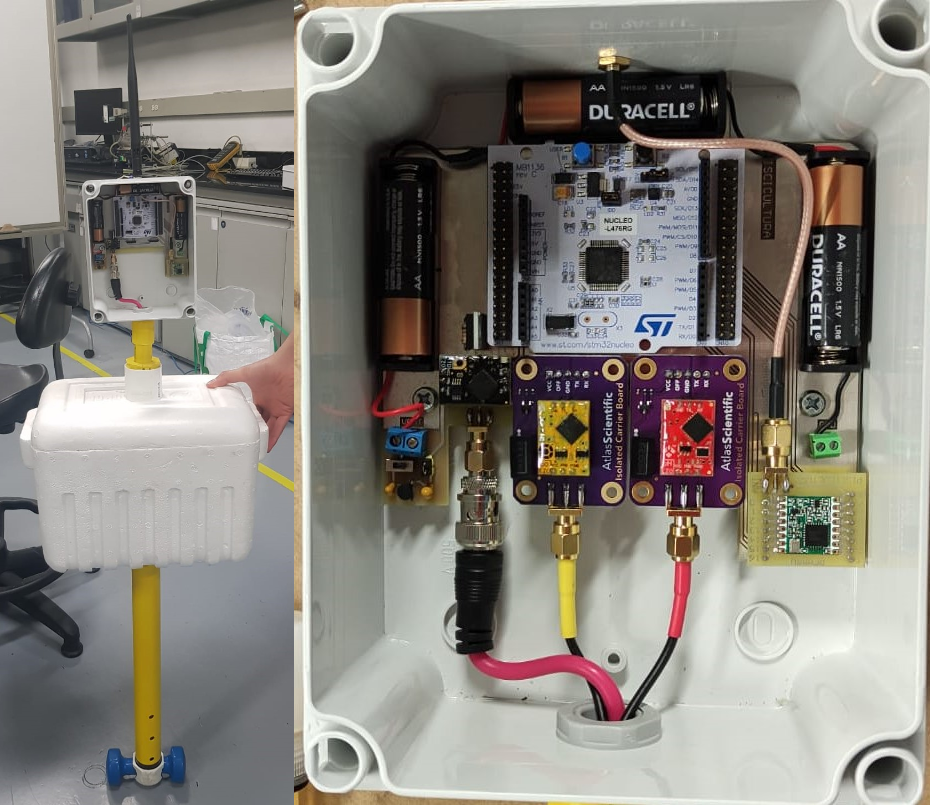
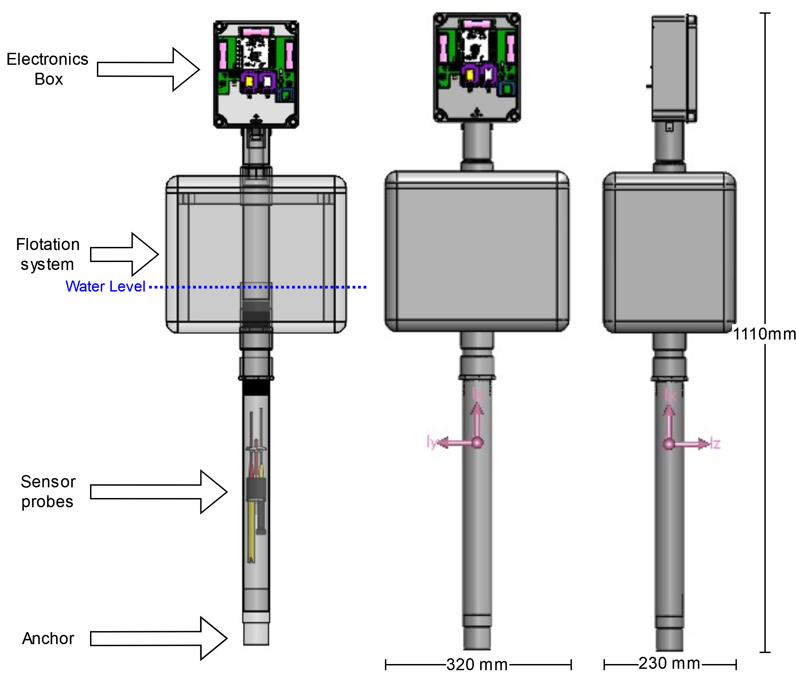

### Overview

This project was developed between 2020 and 2022 to build a remote water quality monitoring prototype for fish farmers in Huila, Colombia. 

Note that for a more detailed discussion, the published research article can be consulted (it is open access): [Open-source low-cost design of a buoy for remote water quality monitoring in fish farming](https://journals.plos.org/plosone/article?id=10.1371/journal.pone.0270202)

### Problem
The problem we set out to work on was to provide data to fish farmers to improve decision-making. At the time, small and medium fish farmers in Colombia had very little data to base their decisions on. Commercially available devices they used consisted of probes that were manually placed by a worker at the lake where they wanted to measure. This introduced a variety of problems, for example:
- Water quality variables, such as dissolved oxygen, vary during the day. Manually checking at different times can miss identifying dangerous levels that only occur during a certain period.
- It can be complicated to test at different locations across all lakes frequently.
- Probes were quite expensive and could be damaged by the workers at the farm. This meant that the farm could be left with few or no devices at all for measurement.

### Development

The first part of the project was to identify which water quality variables needed to be measured. The following 3 variables were decided:
- Temperature
- Dissolved Oxygen
- pH

Of these 3, dissolved oxygen would be the most critical, and will be the main focus going forward. This is because dissolved oxygen (measured in mg/dl) needs to be above a minimum threshold to maintain healthy conditions for the fish. When it is too low, aerators are used to increase it. However, since there is very little water quality data available, only coming from sporadic measurements done manually by probes, fish farmers have almost no idea about when to turn on or off the aerators. This causes 2 important consequences:
- Aerators were turned on, but dissolved oxygen wasn't in dangerous levels. This increased the energy costs of the farm considerably.
- Aerators were not turned on when they needed to be, because dissolved oxygen was low enough. This could impact the farm production by affecting the fish size, or even leading to dead fish.

Other issues encountered at the farms are little access to connectivity and electricity. There may not be a reliable connection for transmitting data or powering the device at the installation site. For this, it was decided that the prototype had to be low-power to be powered by batteries, and it would use LoRaWAN for transmitting data to a central point at the farm. Therefore, the prototype had to implement the following:

- Battery-powered
- Data transmission using LoRaWAN
- Measure water temperature, dissolved oxygen and pH

In addition, it was also decided that the device would be a floating buoy placed at the artificial lakes. This way, no additional installation (poles, etc) would be required for the device. The buoy would simply be placed at the desired location and it would be kept fixed using an anchor. 

### Results

I built a battery-powered buoy that transmitted 3 water quality variables automatically using LoRaWAN.

<!---
Quizas este diagrama se puede simplificar.
-->

